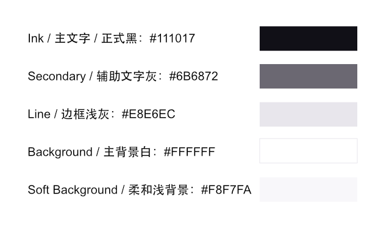
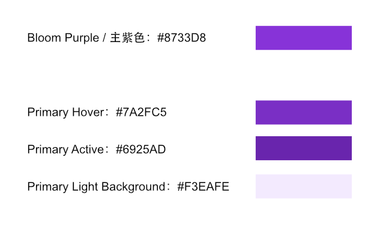
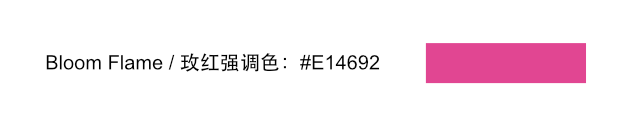
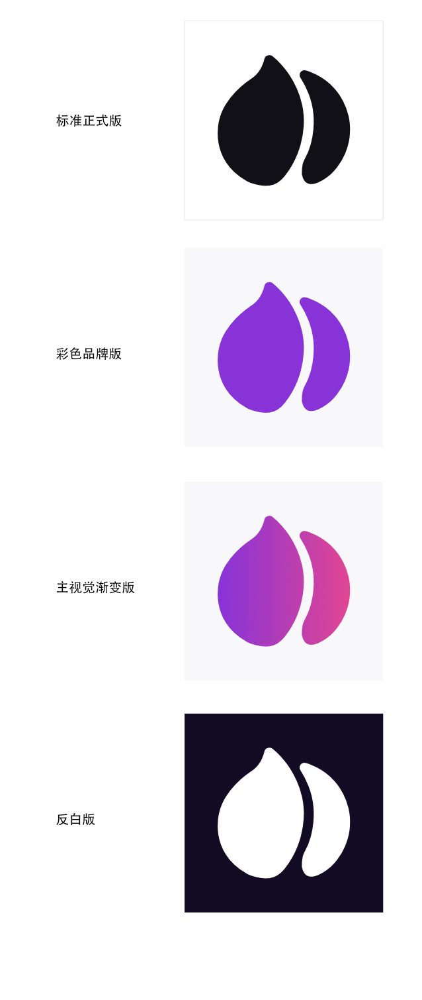
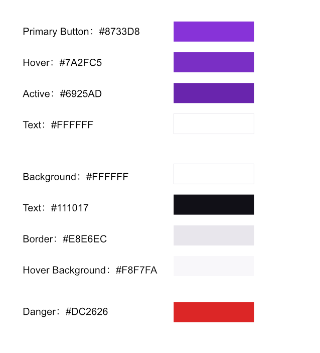
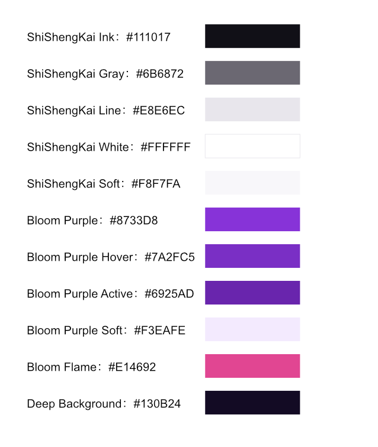

# 始盛开颜色系统

**不要把“始盛开”做成满屏紫色品牌，而是用黑白灰做基础，紫色作为 AI 能量色。**

## 1. 品牌基础色



用于大面积背景、文字、官网主体、正式文件。

```text
Ink / 主文字 / 正式黑：#111017
Secondary / 辅助文字灰：#6B6872
Line / 边框浅灰：#E8E6EC
Background / 主背景白：#FFFFFF
Soft Background / 柔和浅背景：#F8F7FA
```

建议比例：

```text
黑白灰：80%
紫色：15%
玫红：5%
```

⸻

## 2. 品牌能量色：紫色



用于 AI 感、按钮、重点高亮、品牌彩色版 LOGO。

```text
Bloom Purple / 主紫色：#8733D8
```

配套状态色：

```text
Primary Hover：#7A2FC5
Primary Active：#6925AD
Primary Light Background：#F3EAFE
```

⸻

## 3. 品牌强调色：玫红



只用于少量强调、渐变终点、重要视觉点，不要大面积使用。

```text
Bloom Flame / 玫红强调色：#E14692
```

适合用于：

```text
渐变终点
品牌海报
AI 生成效果
小面积图标高亮
特殊活动视觉
```

⸻

## 4. LOGO 应该怎么用色



### 标准正式版

```text
LOGO：#111017
背景：#FFFFFF
```

这是最常用、最耐看的版本。适合官网导航栏、合同、发票、PPT、公司文件。

### 彩色品牌版

```text
LOGO：#8733D8
背景：#FFFFFF 或 #F8F7FA
```

适合官网首页、品牌页、社交头像、产品介绍页。

### 主视觉渐变版

```text
Gradient：#8733D8 → #E14692
背景：#FFFFFF / #F8F7FA / 深色背景
```

只用于品牌主视觉、App icon、海报、发布图，不作为唯一标准版。

### 反白版

```text
LOGO：#FFFFFF
背景：#111017 或 深紫黑
```

深色背景建议：

```text
Deep Background：#130B24
```

⸻

## 5. UI 主按钮颜色



主按钮建议用紫色，不用黑色。

```text
Primary Button：#8733D8
Hover：#7A2FC5
Active：#6925AD
Text：#FFFFFF
```

次按钮：

```text
Background：#FFFFFF
Text：#111017
Border：#E8E6EC
Hover Background：#F8F7FA
```

危险操作不要用品牌玫红，单独用系统红：

```text
Danger：#DC2626
```

⸻

## 6. 最终推荐色板



```text
ShiShengKai Ink：#111017
ShiShengKai Gray：#6B6872
ShiShengKai Line：#E8E6EC
ShiShengKai White：#FFFFFF
ShiShengKai Soft：#F8F7FA
Bloom Purple：#8733D8
Bloom Purple Hover：#7A2FC5
Bloom Purple Active：#6925AD
Bloom Purple Soft：#F3EAFE
Bloom Flame：#E14692
Deep Background：#130B24
```

最终用法一句话

**公司主识别用黑白灰，彩色 LOGO 和主按钮用 #8733D8，品牌主视觉才用 #8733D8 → #E14692 渐变。**